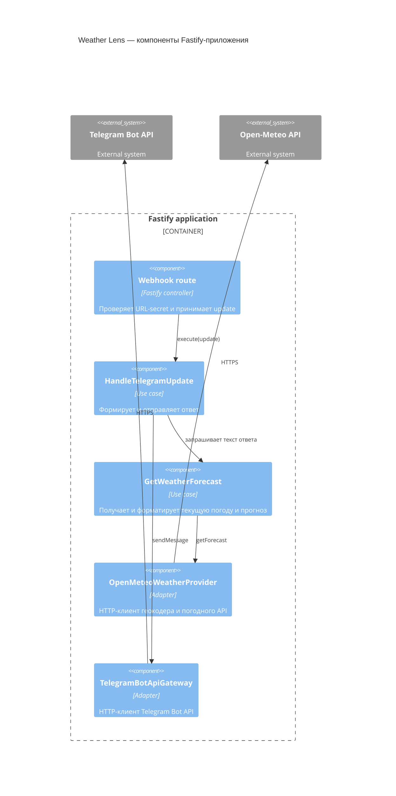

# C4 — Components

```mermaid
C4Component
    title Weather Lens — компоненты Fastify-приложения
    Container_Boundary(api, "Fastify application") {
      Component(route, "Webhook route", "Fastify controller", "Проверяет URL-secret и принимает update")
      Component(handler, "HandleTelegramUpdate", "Use case", "Формирует и отправляет ответ")
      Component(weather, "GetWeatherForecast", "Use case", "Получает и форматирует текущую погоду и прогноз")
      Component(openmeteo, "OpenMeteoWeatherProvider", "Adapter", "HTTP-клиент геокодера и погодного API")
      Component(tg, "TelegramBotApiGateway", "Adapter", "HTTP-клиент Telegram Bot API")
    }
    System_Ext(telegram, "Telegram Bot API", "External system")
    System_Ext(externalWeather, "Open-Meteo API", "External system")
    Rel(route, handler, "execute(update)")
    Rel(handler, weather, "запрашивает текст ответа")
    Rel(handler, tg, "sendMessage")
    Rel(weather, openmeteo, "getForecast")
    Rel(tg, telegram, "HTTPS")
    Rel(openmeteo, externalWeather, "HTTPS")
```
