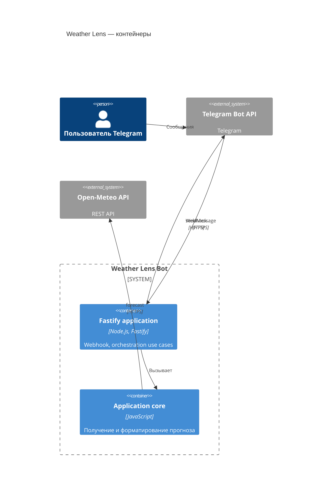

# C4 — Container

```mermaid
C4Container
    title Weather Lens — контейнеры
    Person(user, "Пользователь Telegram")
    System_Boundary(system, "Weather Lens Bot") {
      Container(api, "Fastify application", "Node.js, Fastify", "Webhook, orchestration use cases")
      Container(app, "Application core", "JavaScript", "Получение и форматирование прогноза")
    }
    System_Ext(telegram, "Telegram Bot API", "Telegram")
    System_Ext(openmeteo, "Open-Meteo API", "REST API")
    Rel(user, telegram, "Сообщения")
    Rel(telegram, api, "Webhook", "HTTPS")
    Rel(api, app, "Вызывает")
    Rel(api, telegram, "sendMessage", "HTTPS")
    Rel(app, openmeteo, "forecast", "HTTPS")
```
