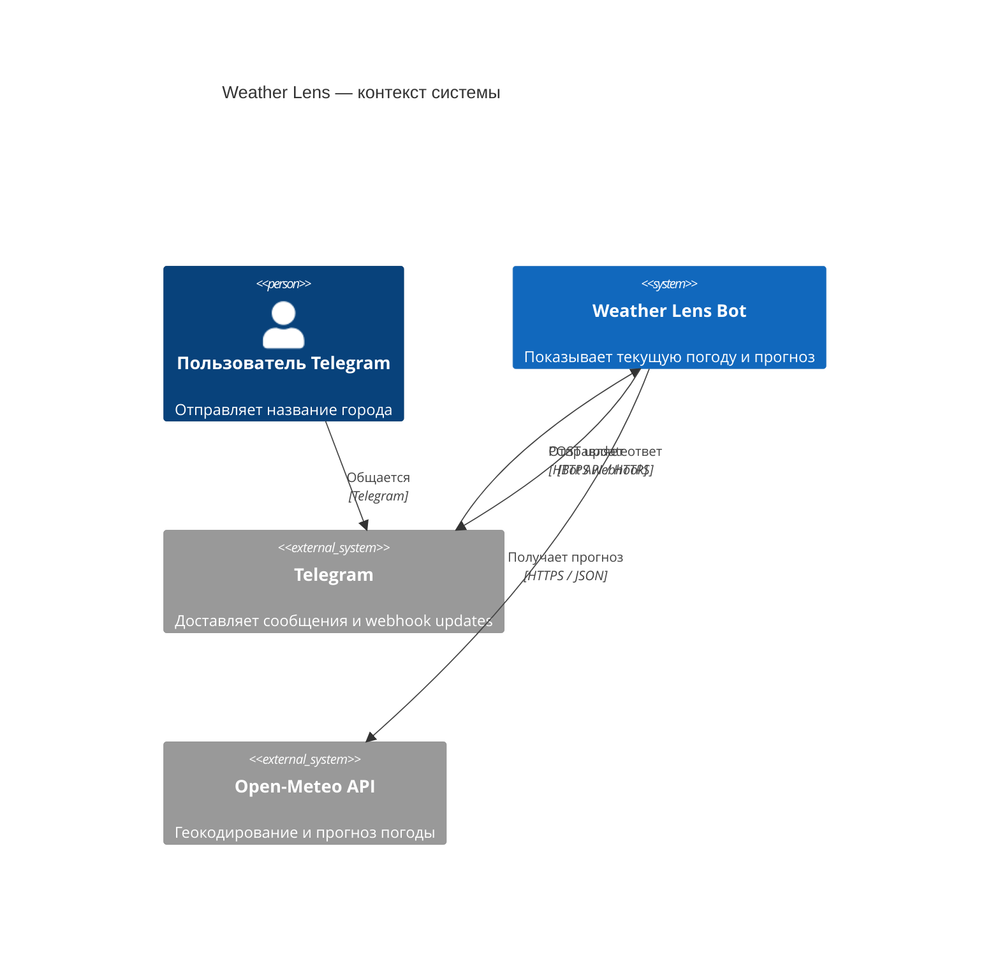

# C4 — System Context

```mermaid
C4Context
    title Weather Lens — контекст системы
    Person(user, "Пользователь Telegram", "Отправляет название города")
    System(bot, "Weather Lens Bot", "Показывает текущую погоду и прогноз")
    System_Ext(telegram, "Telegram", "Доставляет сообщения и webhook updates")
    System_Ext(openmeteo, "Open-Meteo API", "Геокодирование и прогноз погоды")
    Rel(user, telegram, "Общается", "Telegram")
    Rel(telegram, bot, "POST update", "HTTPS webhook")
    Rel(bot, telegram, "Отправляет ответ", "Bot API / HTTPS")
    Rel(bot, openmeteo, "Получает прогноз", "HTTPS / JSON")
```
